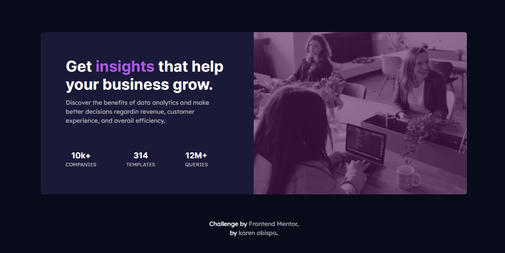

# Frontend Mentor - Stats preview card component solution
## Welcome! 👋

This is a solution to the [Stats preview card component challenge on Frontend Mentor](https://www.frontendmentor.io/challenges/stats-preview-card-component-8JqbgoU62). Frontend Mentor challenges help you improve your coding skills by building realistic projects. Try [Frontend Mentor](https://frontendmentor.io/) for free. 

## Table of contents

- [Overview](#overview)
  - [The challenge](#the-challenge)
  - [Screenshot](#screenshot)
  - [Links](#links)
- [My process](#my-process)
  - [Built with](#built-with)
  - [What I learned](#what-i-learned)
  - [Useful resources](#useful-resources)
- [Author](#author)


## Overview

### The challenge

Users should be able to:

- View the optimal layout depending on their device's screen size

### Screenshot



Add a screenshot of my solution. 

### Links

- Solution URL: [Add solution URL here](https://github.com/sskaren1/stats-preview-card-component.git)
- Live Site URL: [Add live site URL here](https://sk1-stats-preview-card.netlify.app)

## My process

### Built with
- HTML5 markup
- CSS custom properties
- Flexbox
- CSS Grid
- Mobile-first workflow
- Responsive layout

### What I learned

I learned to use CSS to give the components a design, I also learned to use flex and grid to be able to position the elements.

I also learned to use the background-image where I position the image and the text block so as not to use two div

```html
 <div class="content">
    <div class="card">
        <div class="container">
            <div class="cardText">
            </div>
        </div>
    </div>      
</div> 
```
```css
.card{
    background-image: linear-gradient(to bottom, hsla(295, 56%, 21%, 0.6) 31%, var(--cardbackground) 0%),url(./../images/image-header-desktop.jpg);
    background-repeat: repeat,no-repeat;
    background-position: top;
    background-size: contain;    
}
@media (min-width: 768px){
    .card{
        background-image: linear-gradient(to left, hsla(295, 56%, 21%, 0.6) 50%, var(--cardbackground) 0%),url(./../images/image-header-desktop.jpg);
        background-position: right;
        background-size: cover, 50% 100%;
    }
}
.container{
    display: grid;
    grid-template-rows: 1fr 2fr;  
    justify-content: space-between; 
}
@media (min-width: 768px){
    .container{
        grid-template-rows: unset;
        grid-template-columns: 1fr 1fr;
        column-gap: 2rem;
        justify-content: space-between;        
    }
}
.cardText{
    padding: 1rem 1.5rem;
    grid-row: 2/3;    
}
```

### Useful resources

- [W3Schools Online Web Tutorials](https://www.w3schools.com/) - This is an amazing website for learning coding online.
- [MDN Web Docs](https://developer.mozilla.org/es/) - This is an amazing documentation repository and learning resource for web developers.
- [Stackoverflow](https://stackoverflow.com/) - This site helped me get answers to problems I had while doing this project.

## Author

- Frontend Mentor - [@sskaren1](https://www.frontendmentor.io/profile/sskaren1)
- GitHub - [@sskaren1](https://github.com/sskaren1)

